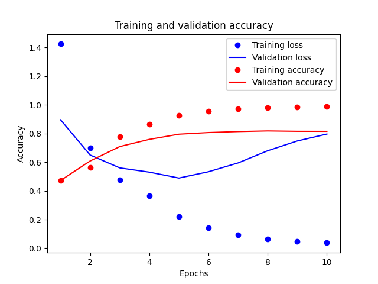

# Twitter Sentiment Analysis

A sentiment analyzer was trained on [This Kaggle Dataset](https://www.kaggle.com/datasets/yasserh/twitter-tweets-sentiment-dataset) of 27,481 tweets labelled "positive" and "negative". 

## Architecture
The neural net uses an embedding layer, an LSTM layer and a dense layer with sigmoid activation function. The word embedding layer is used because it turns the sparse vectors returned by the tokenizer into dense vectors. 

The original data contained "positive", "negative", and "neutral" labels. To simplify the problem into a binary classifier , the "neutral" tweets were taken out. 

Each of the tweets was parsed and vectorized using the Tensorflow Tokenizer. The maximum sequence length was 120 words.

## Results

The training results are shown below:

The model was clearly overfitted since the training accuracy exceeds the validation accuracy. 

| Metric | Value |
|--|--|
| Testing Accuracy | 81% |
| Testing loss   |   1.16 |

## References 
[Text Classification with RNN's](https://www.tensorflow.org/text/tutorials/text_classification_rnn)

[Medium: Spam detection using RNN](https://hemantranvir.medium.com/spam-detection-using-rnn-simplernn-lstm-with-step-by-step-explanation-530367608071)

[Medium: Sentiment analysis with Tensorflow](https://scorrea92.medium.com/nlp-twitter-sentiment-analysis-with-tensorflow-15e1b2594cfa)

[Tensorflow on Embeddings](https://www.tensorflow.org/text/guide/word_embeddings#compile_and_train_the_model)

